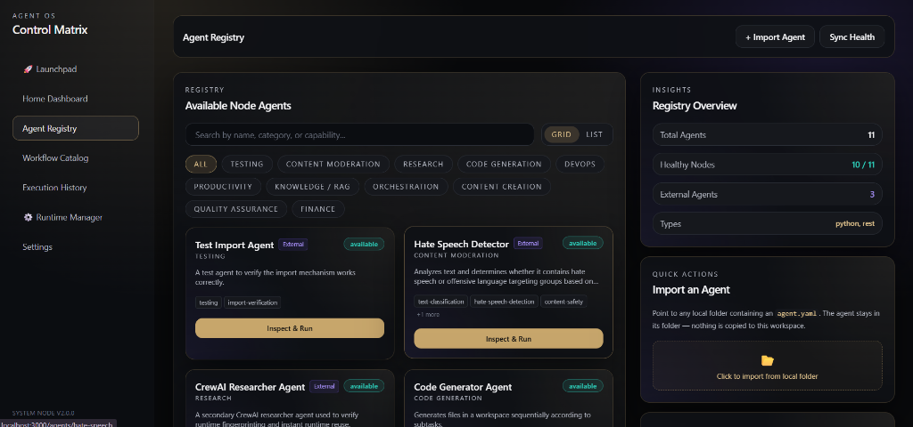
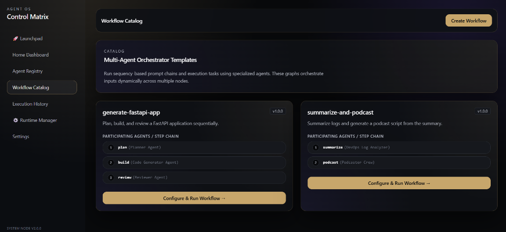
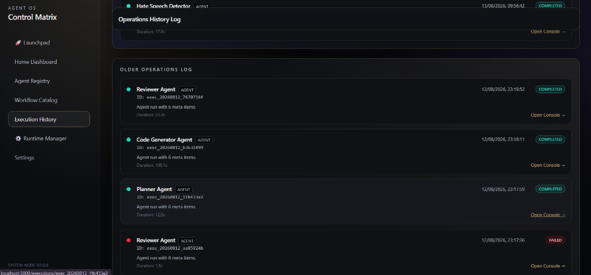
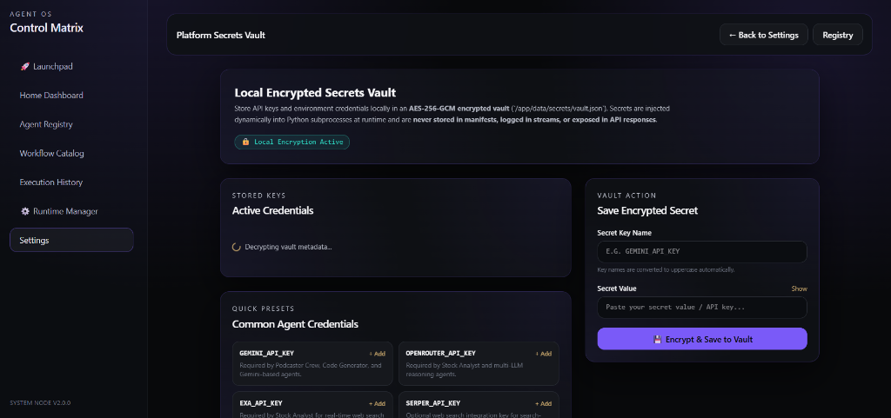
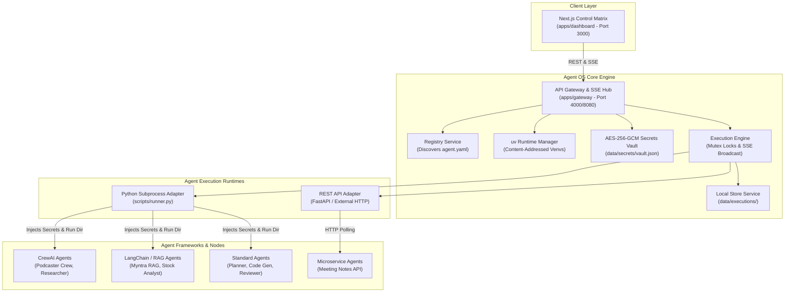

# 🤖 Agent OS / Agent Workspace

> **A local-first AI agent orchestration platform with `uv`-managed runtimes, real-time execution streaming, workflow composition, and support for imported CrewAI & LangChain agents.**

[](LICENSE)
[](https://nodejs.org/)
[](https://www.python.org/)
[](https://github.com/astral-sh/uv)
[](docker-compose.yml)

---

## 🖼️ User Interface & Platform Screenshots

### Agent Registry Matrix
Discover, inspect, run, and manage both local workspace agents and imported external agent nodes.


### Workflow Catalog
Orchestrate multi-agent execution graphs, prompt chains, and automated multi-step pipelines.


### Execution History & Real-Time Logs
Monitor active executions, inspect step-by-step stdout/stderr streams via Server-Sent Events (SSE), and access generated output artifacts.


### Encrypted Platform Secrets Vault
Secure local secret storage using hardware-backed AES-256-GCM encryption with dynamic in-memory subprocess injection.


---

## 🏗️ Architecture Diagram



---

## ✨ Key Features

- **🔒 Local-First Philosophy**: Operates entirely on your local machine or self-hosted server. Your code, execution logs, and secret keys never touch external third-party servers.
- **⚡ Dynamic `uv` Managed Runtime System**: Instantaneous Python virtual environment creation and package resolution using `uv`. Environments are content-addressed by SHA-256 dependency hashes, shared across agents with identical dependency graphs, and automatically garbage-collected.
- **📡 Real-Time SSE Execution Streaming**: Stream execution status (`queued`, `started`, `completed`, `failed`, `cancelled`), line-by-line logs, and final structured output artifacts directly to the UI matrix.
- **🔄 Multi-Agent Workflow Orchestration**: Chain multiple specialized agents (e.g., Planner $\rightarrow$ Code Generator $\rightarrow$ Code Reviewer) with automated variable interpolation and step context propagation.
- **🔌 Multi-Framework Compatibility**: Seamlessly import and execute agents built on **CrewAI**, **LangChain**, standard Python scripts, or external REST microservices.
- **🔑 Hardware-Backed Local Secrets Vault**: Sensitive keys (`GEMINI_API_KEY`, `OPENROUTER_API_KEY`, etc.) are encrypted via AES-256-GCM and injected strictly in-memory into child subprocesses at execution time.
- **🛡️ Process Tree Safety & Cancellation**: Gracefully terminate hung or unresponsive agent processes across all operating systems using process tree killing (`tree-kill`).

---

## 🔒 Local-First Philosophy

Agent OS is engineered to give developers total ownership of their AI agent workloads:

1. **Zero External Metadata Tracking**: Agent manifests (`agent.yaml`), execution state, and generated output artifacts reside entirely in local file systems (`data/executions/`).
2. **Dynamic In-Memory Credentials**: API credentials remain safely in your encrypted local vault and are injected directly into child process environment blocks—never logged, never serialized into execution records, and never exposed in REST responses.
3. **Reproducible Subprocess Isolation**: Every agent invocation runs in its own working directory with strict execution locks, ensuring zero side-effects between concurrent agent tasks.

---

## ⚡ Runtime Manager Explanation

The **Runtime Manager** eliminates environment configuration headaches when working with Python AI frameworks:

- **Dependency Graph Fingerprinting**: Calculates a SHA-256 digest based on the Python target version and normalized lockfile/requirements content (`uv.lock`, `pyproject.toml`, or `requirements.txt`).
- **Shared Content-Addressed Venvs**: If two separate CrewAI or LangChain agents share identical dependencies, they automatically reuse the same cached virtual environment in `runtimes/py311/<hash>/.venv`.
- **Automatic Garbage Collection**: Periodically purges stale or unreferenced runtimes to maintain total disk usage under defined storage quotas while protecting recent runs.

---

## 🤖 Supported Agent Types

| Type | Description | Frameworks | Execution Adapter |
| --- | --- | --- | --- |
| **`python`** | Subprocess Python scripts/crews | CrewAI, LangChain, LlamaIndex, Custom Python | `PythonSubprocessAdapter` (`scripts/runner.py`) |
| **`rest`** | External HTTP microservices | FastAPI, Flask, Express, Docker Services | `RestApiAdapter` (HTTP Polling / Webhooks) |
| **`external`** | Imported folder-based agents | Any Python framework with `agent.yaml` | `PythonSubprocessAdapter` (Dynamic Import) |

---

## 🚀 Quick Start (Local Development)

### Prerequisites

- **Node.js**: `>= 20.0.0`
- **npm**: `>= 10.0.0`
- **Python**: `>= 3.10`
- **uv**: `>= 0.4.0` (Install via `pip install uv` or `curl -LsSf https://astral.sh/uv/install.sh`)

### 1. Clone & Install Dependencies

```bash
git clone https://github.com/your-username/agent-workspace.git
cd agent-workspace
npm install
```

### 2. Configure Environment Variables

```bash
cp .env.example .env
cp apps/gateway/.env.example apps/gateway/.env
cp apps/dashboard/.env.example apps/dashboard/.env
```

### 3. Start Development Servers

```bash
npm run dev
```

- **Dashboard Control Matrix**: [http://localhost:3000](http://localhost:3000)
- **API Gateway**: [http://localhost:4000](http://localhost:4000) (or `http://localhost:8080`)
- **Health Check**: [http://localhost:4000/health](http://localhost:4000/health)

---

## 🐳 Quick Start (Docker Compose)

Run the complete platform inside isolated containers:

```bash
docker-compose up --build
```

Access the UI at [http://localhost:3000](http://localhost:3000). The Gateway service automatically configures managed `uv` runtimes inside the containerized environment.

---

## 📥 Importing External Agents

You can import any external CrewAI, LangChain, or Python agent codebase without modifying its internal logic.

1. Drop the agent folder into `external-agents/` (or click **+ Import Agent** in the UI).
2. Ensure an `agent.yaml` manifest exists in the agent folder:

```yaml
id: my-custom-crew
name: Custom Research Crew
version: 1.0.0
category: Research
type: python
entrypoint: main.py
workingDirectory: ./
requiredEnv:
  - OPENROUTER_API_KEY
inputSchema:
  type: object
  properties:
    topic:
      type: string
      required: true
      description: "Research topic for the crew"
```

3. Click **Sync Health** or call `POST /api/agents/reload` to register the imported agent instantly.

---

## 🔄 Workflow Example

Here is a 3-stage software development pipeline orchestrated by Agent OS (`workflows/generate-fastapi-app.yaml`):

```yaml
id: generate-fastapi-app
name: FastAPI Application Generator
description: Plan, build, and review a FastAPI application sequentially using specialized agents.

steps:
  - id: plan
    agentId: planner-agent
    inputMapping:
      prompt: "${input.prompt}"

  - id: build
    agentId: code-generator-agent
    inputMapping:
      plan: "${steps.plan.output.plan}"

  - id: review
    agentId: reviewer-agent
    inputMapping:
      code: "${steps.build.output.code}"
```

Trigger workflow execution via REST:

```bash
curl -X POST http://localhost:4000/api/workflows/generate-fastapi-app/execute \
  -H "Content-Type: application/json" \
  -d '{"prompt": "Build a REST API for a task management application with user authentication"}'
```

---

## 📁 Project Structure

```
agent-workspace/
├── apps/
│   ├── dashboard/              # Next.js 16 / React 19 UI Control Matrix
│   └── gateway/                # Node.js / Express API Gateway & SSE Hub
├── agents/                     # Built-in standard agents (Planner, Code Gen, Reviewer)
├── external-agents/            # Imported external agents (CrewAI, LangChain, etc.)
├── workflows/                  # Declarative multi-agent workflow manifests
├── packages/                   # Shared TypeScript utilities & types
├── docs/                       # Architectural docs, specifications & screenshots
│   ├── index.md                # Documentation index
│   ├── architecture.md         # System architecture specification
│   ├── runtime-architecture.md # uv runtime manager specification
│   ├── api.md                  # REST API & SSE contract
│   ├── workflows.md            # Workflow engine specification
│   └── assets/                 # Platform screenshots
├── scripts/                    # Subprocess python runner (`runner.py`)
├── docker-compose.yml          # Docker composition manifest
├── .env.example                # Root environment template
├── PREPARE_FOR_GITHUB.md       # Pre-push release checklist
├── CONTRIBUTING.md             # Developer contribution guidelines
├── SECURITY.md                 # Security architecture & vulnerability policy
├── CODE_OF_CONDUCT.md          # Community guidelines
└── LICENSE                     # MIT Open Source License
```

---

## 🛡️ Security Note

- **Zero Exposure**: No real API keys or credentials are included in this repository.
- **Local Isolation**: Hardware-backed AES-256-GCM encryption isolates sensitive keys on local disk.
- **Log Masking**: Automated secret string redaction prevents credential leakage in real-time SSE execution logs.

See [SECURITY.md](SECURITY.md) for full details on security controls and reporting policies.

---

## 🗺️ Roadmap

- [x] **Phase 1**: Gateway core, SSE streaming, process isolation, and dynamic agent loading.
- [x] **Phase 2**: `uv` Runtime Manager integration, content-addressed venv caching, and automated GC.
- [x] **Phase 3**: AES-256-GCM Local Secrets Vault, workflow composition engine, and external agent importer.
- [ ] **Phase 4**: Multi-node cluster execution & remote agent worker nodes.
- [ ] **Phase 5**: Open Telemetry execution tracing & agent performance benchmarking suite.

---

## 🤝 Contributing

Contributions are welcome! Please review our [Contributing Guidelines](CONTRIBUTING.md) and [Code of Conduct](CODE_OF_CONDUCT.md) before submitting a Pull Request.

---

## 📄 License

Distributed under the **MIT License**. See [LICENSE](LICENSE) for more information.
