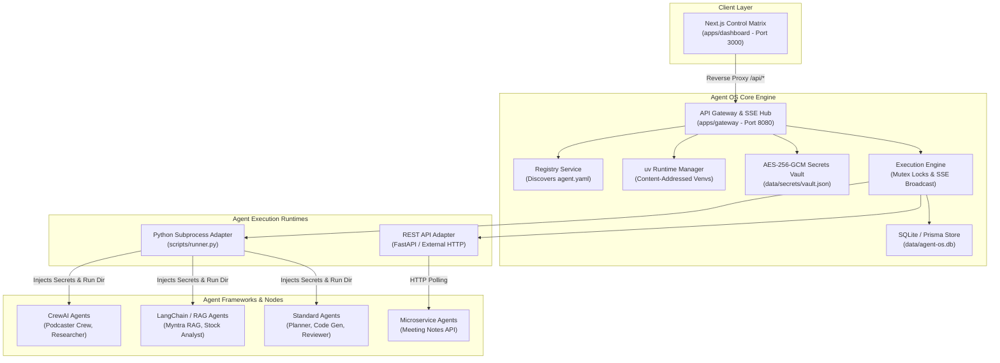

# 🤖 Agent OS / Agent Workspace

> **A local-first AI agent orchestration platform with `uv`-managed runtimes, real-time execution streaming, workflow composition, and support for imported CrewAI & LangChain agents.**

[](LICENSE)
[](https://nodejs.org/)
[](https://www.python.org/)
[](https://github.com/astral-sh/uv)
[](docker-compose.yml)

---

## 🖼️ User Interface & Platform Screenshots

### Agent Registry Matrix
Discover, inspect, run, and manage both local workspace agents and imported external agent nodes.


### Workflow Catalog
Orchestrate multi-agent execution graphs, prompt chains, and automated multi-step pipelines.


### Execution History & Real-Time Logs
Monitor active executions, inspect step-by-step stdout/stderr streams via Server-Sent Events (SSE), and access generated output artifacts.


### Encrypted Platform Secrets Vault
Secure local secret storage using hardware-backed AES-256-GCM encryption with dynamic in-memory subprocess injection.


---

## 🏗️ Architecture Diagram



---

## 🐳 Docker Architecture & Containerization

### 1. Why Docker is Used
Docker containerization provides:
- **Reproducible Runtime Environments**: Eliminates host-level Python/Node version drift and operating system library mismatches.
- **Service Isolation**: Completely separates the Next.js web frontend from the API Gateway and Python subprocess execution engine.
- **Controlled Container Networking**: Enables secure internal microservice communication over a private Docker bridge network.
- **Persistent Data Volume Management**: Preserves SQLite database state, compiled Python virtual environments, and Astral `uv` package caches across container restarts.
- **Native Health Monitoring**: Provides automated Docker daemon health checks to ensure service availability.
- **Simplified Deployment**: Enables single-command local infrastructure bring-up via `docker compose up -d`.

### 2. Container Architecture

```text
Browser (Host OS)
  │
  ├─► http://localhost:3000 (UI / Next.js Server)
  │     │
  │     └─► Docker Internal Network (agent-dashboard_default)
  │           │
  │           └─► http://gateway:8080 (API Gateway / Express)
  │                 │
  │                 ├──► SQLite Database (/app/data/agent-os.db)
  │                 ├──► Managed Python Runtimes (/app/runtimes)
  │                 ├──► Python Agent Subprocesses (scripts/runner.py)
  │                 └──► Astral uv Cache (/root/.cache/uv)
```

#### Dashboard Container (`apps/dashboard/Dockerfile`)
- **Base Image**: `node:20-slim`
- **Role**: Next.js 16 standalone web application and reverse-proxy interface.
- **Exposed Port**: `3000`
- **Security User**: `USER node` (UID 1000 - Unprivileged execution).
- **Build Method**: Multi-stage build (Builder stage compiles Next.js standalone bundle; Runner stage copies `.next/standalone`, `.next/static`, and `public`).
- **Network Interface**: Configured with `HOSTNAME="0.0.0.0"` to listen on all interfaces.
- **Health Check**: Native `node -e` HTTP check against `http://localhost:3000`.

#### Gateway Container (`apps/gateway/Dockerfile`)
- **Base Image**: `node:20-slim`
- **Role**: Express API Gateway, SSE log streamer, and Python subprocess execution manager.
- **Exposed Port**: `8080`
- **Environment**: Node.js 20, Python 3.11, Astral `uv` 0.4.0, `build-essential`, and `procps`.
- **Security User**: Runs as `root` intentionally to permit dynamic Python virtual environment creation over host bind mounts.
- **Health Check**: Native `node -e` HTTP check against `http://localhost:8080/api/health`.
- **Subprocess Management**: Spawns Python agents as child processes (`scripts/runner.py`) using managed virtual environment interpreters.

---

### 3. Docker Compose Networking

- **Network Name**: `agent-dashboard_default` (Docker bridge network).
- **Service Discovery**: Containers communicate using internal Compose service names (e.g., `http://gateway:8080`).
- **Browser-to-Dashboard Proxying**:
  - The browser requests relative API paths (`/api/...`) from `http://localhost:3000`.
  - Next.js server-side rewrites in `next.config.ts` catch `/api/:path*` and proxy requests internally to `GATEWAY_INTERNAL_URL=http://gateway:8080`.
  - **Key Benefit**: The browser does not make direct cross-origin fetches to `localhost:8080`, bypassing browser CORS issues entirely.

| Access Type | Target Address | Description |
| :--- | :--- | :--- |
| **Host Access (Browser / curl)** | `http://localhost:3000` | Accesses the Dashboard web UI and proxied API routes. |
| **Host Access (Direct API)** | `http://localhost:8080` | Direct host access to Gateway Express routes. |
| **Container-to-Container** | `http://gateway:8080` | Private bridge network communication from Dashboard to Gateway. |

---

### 4. Volumes & Persistent Storage

The `docker-compose.yml` manifest configures three host bind mounts for data durability:

```yaml
volumes:
  - ./data:/app/data
  - ./runtimes:/app/runtimes
  - ./uv-cache:/root/.cache/uv
```

* **`./data -> /app/data`**: Stores the persistent SQLite database (`agent-os.db`), encrypted secrets vault (`data/secrets/`), execution output logs (`data/executions/`), and imported external agent definitions (`data/registry/`).
* **`./runtimes -> /app/runtimes`**: Persists content-addressed Python virtual environments (`/app/runtimes/py311/<hash>/.venv`). Prevents rebuilding Python environments on every container launch.
* **`./uv-cache -> /root/.cache/uv`**: Caches downloaded Python wheel archives across container rebuilds.

#### Storage Layer Classifications
- **Image Layer**: Immutable base binaries (Node.js, Python 3.11, `uv`, `procps`).
- **Container Filesystem**: Ephemeral process space; destroyed when containers are recreated.
- **Host Bind Mounts**: Durable persistent data on the host disk that survives container teardown.

---

### 5. Gateway Root User Security Decision

The Gateway container **intentionally runs as `root` (UID 0)**.

#### Technical Rationale:
- The Gateway process dynamically creates, builds, and modifies Python virtual environments inside `/app/runtimes`.
- The storage folders (`/app/runtimes`, `/app/data`, `/root/.cache/uv`) are host bind mounts.
- Across Windows (WSL2), macOS, and Linux hosts, file ownership permissions on bind-mounted directories vary significantly. Running Gateway as an unprivileged user (`USER node`) leads to `EACCES: permission denied` errors during `uv venv` creation and `procps` process tree cancellation.
- This is a deliberate, documented MVP engineering tradeoff to guarantee cross-platform host volume write compatibility.

#### Dashboard Contrast:
- The **Dashboard container runs as `USER node` (UID 1000)** because it is a read-mostly Next.js web application that requires zero host volume disk access.

---

### 6. Dockerfile Security & Build Optimizations

- **Deterministic `npm ci`**: Replaced `npm install` with `npm ci` to enforce lockfile compliance and prevent dependency drift.
- **Layer-Cached Context Filtering**: Implemented a root `.dockerignore` to prevent uploading local `node_modules`, `.git`, `.env`, `coverage`, `.next`, `dist`, local databases, and temporary logs into image build contexts.
- **Pinned Binary Acquisition**: Replaced `curl -LsSf https://astral.sh/uv/install.sh | sh` with pinned multi-stage binary copying:
  ```dockerfile
  COPY --from=ghcr.io/astral-sh/uv:0.4.0 /uv /uvx /bin/
  ```
  Eliminates remote script execution risks and leverages Docker binary caching.
- **Native Health Checks**: Added explicit `HEALTHCHECK` instructions in both Dockerfiles to enable container health reporting outside of Compose.
- **Multi-Stage Frontend Build**: Dashboard Dockerfile uses a 2-stage build to output a minimal production Next.js standalone package (~360 MB).

---

### 7. Monorepo Docker Build Context

The repository is structured as an npm workspace monorepo (`apps/*`, `packages/*`).

```yaml
services:
  gateway:
    build:
      context: .
      dockerfile: apps/gateway/Dockerfile

  dashboard:
    build:
      context: .
      dockerfile: apps/dashboard/Dockerfile
```

#### Why Root Build Context is Mandatory:
- The unified lockfile `package-lock.json` exists **only at the repository root**. Sub-directories (`apps/gateway`, `apps/dashboard`) do not have individual lockfiles.
- Setting `context: .` grants the Docker daemon access to the root lockfile, enabling reproducible workspace-scoped package installation:
  ```dockerfile
  COPY package*.json ./
  COPY apps/gateway/package.json ./apps/gateway/
  RUN npm ci --workspace=@agent-workspace/gateway
  ```

---

### 8. Prisma Database Lifecycle in Docker

- **Prisma Schema Location**: `apps/gateway/prisma/schema.prisma`
- **In-Container Client Generation**: Prisma Client binaries are platform-dependent. Generating Prisma Client on a host machine produces host binaries that fail inside Linux containers.
- **Build Sequence**:
  ```dockerfile
  COPY . .
  RUN npx prisma generate --schema=apps/gateway/prisma/schema.prisma
  RUN npm run build --workspace=@agent-workspace/gateway
  ```
  Generating the query engine after `COPY . .` ensures the Linux-compatible Prisma Client is generated before `tsc` compiles the TypeScript codebase.

---

### 9. Managed Python Runtime Architecture

Python agents are executed in isolated, content-addressed virtual environments:

`/app/runtimes/py311/<runtime-hash>/.venv`

- **Dependency Fingerprinting**: `runtimeService.detectDependencies()` computes a SHA-256 hash of the Python target version and normalized dependency file content (`uv.lock`, `pyproject.toml`, or `requirements.txt`).
- **Environment Sharing**: Agents with identical dependency declarations share the exact same cached runtime.
- **Execution**: The Gateway resolves the exact virtual environment Python interpreter (`/app/runtimes/py311/<hash>/.venv/bin/python`) and passes it to `scripts/runner.py`.

---

### 10. Runtime Association Reconciliation

To maintain clean runtime metadata, the Gateway enforces the following invariant:

> *For every runtime, `metadata.agents` contains ONLY active agents whose current resolved `runtimeHash` equals that runtime's hash.*

#### How Reconciliation Works:
1. **Migration Cleanup**: When an agent's dependencies change or resolve to a new runtime hash, `runtimeService.associateAgent()` automatically disassociates the agent from older runtime metadata files on disk.
2. **Startup & Reload Reconciliation**: Upon Gateway boot (`registryService.load()`), the system scans all active agents, reconciles active associations, and updates historical `metadata.json` files.
3. **Orphaned Runtime Cleanup**: Once an old runtime's `agentCount` reaches `0`, it becomes eligible for safe deletion via `DELETE /api/runtimes/:hash` or Garbage Collection (`runGC`).
4. **Deletion Protection**: `runtimeService.deleteRuntime()` strictly refuses deletion if `agentCount > 0`.

---

### 11. Container Health Checks & Diagnostic Commands

Both services declare native health checks:
- **Gateway**: `http://localhost:8080/api/health`
- **Dashboard**: `http://localhost:3000`

#### Essential Docker Diagnostic Commands

```bash
# Check container status and health state
docker compose ps

# Tail Gateway logs
docker compose logs -f gateway

# Tail Dashboard logs
docker compose logs -f dashboard

# Execute command inside Gateway container
docker compose exec gateway ps -ef

# Test internal container networking from Dashboard to Gateway
docker compose exec dashboard node -e "require('http').get('http://gateway:8080/api/health', r => console.log('Status:', r.statusCode))"
```

---

### 12. Running the Project with Docker

#### Prerequisites
- **Docker Desktop**: Installed and running (supports Docker Compose v2).
- **Environment Configuration**: Copy `.env.example` to `.env`.

#### Commands

```bash
# Build and start services in background mode
docker compose up -d --build

# Verify running container health
docker compose ps

# View unified container logs
docker compose logs -f

# Stop container services
docker compose down

# Force a clean rebuild without cache
docker compose build --no-cache
docker compose up -d
```

---

### 13. Verification & Smoke Testing

After starting the containers, verify system functionality using `curl.exe`:

```powershell
# 1. Gateway Health Check (Direct Host Access)
curl.exe -i http://localhost:8080/api/health

# 2. Dashboard Health Check (Direct Host Access)
curl.exe -i http://localhost:3000/api/health

# 3. Proxied Agent Health Check (Browser Flow via Next.js Proxy)
curl.exe -i http://localhost:3000/api/agents/code-generator-agent/health
```

---

### 14. Security Architecture Summary

| Security Area | Decision | Engineering Rationale |
| :--- | :--- | :--- |
| **Dashboard User** | `USER node` (UID 1000) | Web frontend is read-mostly; runs unprivileged for least-privilege security. |
| **Gateway User** | `root` (UID 0) | Required to create `uv` virtual environments over host bind mounts across OS platforms. |
| **Context Filtering** | Root `.dockerignore` | Prevents baking sensitive `.env` files, logs, and local node_modules into images. |
| **Binary Integrity** | Pinned `uv:0.4.0` | Uses official Astral Docker binary images instead of unchecksummed `curl \| sh`. |
| **Dependency Locks** | `npm ci` Workspaces | Guarantees deterministic container builds anchored to the root `package-lock.json`. |
| **Network Isolation** | Private Compose Bridge | Isolates internal container traffic on `agent-dashboard_default`. |
| **Data Persistence** | Host Bind Mounts | Keeps SQLite database records and virtual environments durable across container lifecycle. |
| **Health Monitoring** | Native Docker Healthchecks | Enables container health tracking for Compose and Docker daemon. |
| **Browser CORS** | Next.js Reverse Proxy | Eliminates cross-origin browser issues by proxying relative `/api/*` requests. |

---

### 15. Known Tradeoffs & Limitations

- **Gateway Container Privileges**: Gateway runs as root to maintain host volume permissions across Windows/WSL2 and Linux.
- **Shared Container Limits**: All Python agent subprocesses run inside the single Gateway container and share its CPU, RAM, and cgroup limits.
- **WSL2 Volume Performance**: File I/O over host bind mounts in WSL2 can be slower than native Linux ext4 filesystems.
- **Gateway Image Size**: The Gateway container image is ~1.48 GB because it packages Node.js, Python 3.11, build compilers (`build-essential`), `procps`, and Astral `uv`.

---

## ✨ Key Features

- **🔒 Local-First Philosophy**: Operates entirely on your local machine or self-hosted server. Your code, execution logs, and secret keys never touch external third-party servers.
- **⚡ Dynamic `uv` Managed Runtime System**: Instantaneous Python virtual environment creation and package resolution using `uv`. Environments are content-addressed by SHA-256 dependency hashes, shared across agents with identical dependency graphs, and automatically garbage-collected.
- **📡 Real-Time SSE Execution Streaming**: Stream execution status (`queued`, `started`, `completed`, `failed`, `cancelled`), line-by-line logs, and final structured output artifacts directly to the UI matrix.
- **🔄 Multi-Agent Workflow Orchestration**: Chain multiple specialized agents (e.g., Planner $\rightarrow$ Code Generator $\rightarrow$ Code Reviewer) with automated variable interpolation and step context propagation.
- **🔌 Multi-Framework Compatibility**: Seamlessly import and execute agents built on **CrewAI**, **LangChain**, standard Python scripts, or external REST microservices.
- **🔑 Hardware-Backed Local Secrets Vault**: Sensitive keys (`GEMINI_API_KEY`, `OPENROUTER_API_KEY`, etc.) are encrypted via AES-256-GCM and injected strictly in-memory into child subprocesses at execution time.
- **🛡️ Process Tree Safety & Cancellation**: Gracefully terminate hung or unresponsive agent processes across all operating systems using process tree killing (`tree-kill`).

---

## 🔒 Local-First Philosophy

Agent OS is engineered to give developers total ownership of their AI agent workloads:

1. **Zero External Metadata Tracking**: Agent manifests (`agent.yaml`), execution state, and generated output artifacts reside entirely in local file systems (`data/executions/`).
2. **Dynamic In-Memory Credentials**: API credentials remain safely in your encrypted local vault and are injected directly into child process environment blocks—never logged, never serialized into execution records, and never exposed in REST responses.
3. **Reproducible Subprocess Isolation**: Every agent invocation runs in its own working directory with strict execution locks, ensuring zero side-effects between concurrent agent tasks.

---

## ⚡ Runtime Manager Explanation

The **Runtime Manager** eliminates environment configuration headaches when working with Python AI frameworks:

- **Dependency Graph Fingerprinting**: Calculates a SHA-256 digest based on the Python target version and normalized lockfile/requirements content (`uv.lock`, `pyproject.toml`, or `requirements.txt`).
- **Shared Content-Addressed Venvs**: If two separate CrewAI or LangChain agents share identical dependencies, they automatically reuse the same cached virtual environment in `runtimes/py311/<hash>/.venv`.
- **Automatic Garbage Collection**: Periodically purges stale or unreferenced runtimes to maintain total disk usage under defined storage quotas while protecting recent runs.

---

## 🤖 Supported Agent Types

| Type | Description | Frameworks | Execution Adapter |
| --- | --- | --- | --- |
| **`python`** | Subprocess Python scripts/crews | CrewAI, LangChain, LlamaIndex, Custom Python | `PythonSubprocessAdapter` (`scripts/runner.py`) |
| **`rest`** | External HTTP microservices | FastAPI, Flask, Express, Docker Services | `RestApiAdapter` (HTTP Polling / Webhooks) |
| **`external`** | Imported folder-based agents | Any Python framework with `agent.yaml` | `PythonSubprocessAdapter` (Dynamic Import) |

---

## 🚀 Quick Start (Local Development)

### Prerequisites

- **Node.js**: `>= 20.0.0`
- **npm**: `>= 10.0.0`
- **Python**: `>= 3.11`
- **uv**: `>= 0.4.0` (Install via `pip install uv` or `curl -LsSf https://astral.sh/uv/install.sh`)

### 1. Clone & Install Dependencies

```bash
git clone https://github.com/your-username/agent-workspace.git
cd agent-workspace
npm install
```

### 2. Configure Environment Variables

```bash
cp .env.example .env
cp apps/gateway/.env.example apps/gateway/.env
cp apps/dashboard/.env.example apps/dashboard/.env
```

### 3. Start Development Servers

```bash
npm run dev
```

- **Dashboard Control Matrix**: [http://localhost:3000](http://localhost:3000)
- **API Gateway**: [http://localhost:8080](http://localhost:8080)
- **Health Check**: [http://localhost:8080/api/health](http://localhost:8080/api/health)

---

## 📥 Importing External Agents

You can import any external CrewAI, LangChain, or Python agent codebase without modifying its internal logic.

1. Drop the agent folder into `external-agents/` (or click **+ Import Agent** in the UI).
2. Ensure an `agent.yaml` manifest exists in the agent folder:

```yaml
id: my-custom-crew
name: Custom Research Crew
version: 1.0.0
category: Research
type: python
entrypoint: main.py
workingDirectory: ./
requiredEnv:
  - OPENROUTER_API_KEY
inputSchema:
  type: object
  properties:
    topic:
      type: string
      required: true
      description: "Research topic for the crew"
```

3. Click **Sync Health** or call `POST /api/registry/import` to register the imported agent instantly.

---

## 🔄 Workflow Example

Here is a 3-stage software development pipeline orchestrated by Agent OS (`workflows/generate-fastapi-app.yaml`):

```yaml
id: generate-fastapi-app
name: FastAPI Application Generator
description: Plan, build, and review a FastAPI application sequentially using specialized agents.

steps:
  - id: plan
    agentId: planner-agent
    inputMapping:
      prompt: "${input.prompt}"

  - id: build
    agentId: code-generator-agent
    inputMapping:
      plan: "${steps.plan.output.plan}"

  - id: review
    agentId: reviewer-agent
    inputMapping:
      code: "${steps.build.output.code}"
```

Trigger workflow execution via REST:

```bash
curl -X POST http://localhost:8080/api/workflows/generate-fastapi-app/run \
  -H "Content-Type: application/json" \
  -d '{"prompt": "Build a REST API for a task management application with user authentication"}'
```

---

## 📁 Project Structure

```
agent-workspace/
├── apps/
│   ├── dashboard/              # Next.js 16 / React 19 UI Control Matrix
│   └── gateway/                # Node.js / Express API Gateway & SSE Hub
├── agents/                     # Built-in standard agents (Planner, Code Gen, Reviewer)
├── external-agents/            # Imported external agents (CrewAI, LangChain, etc.)
├── workflows/                  # Declarative multi-agent workflow manifests
├── packages/                   # Shared TypeScript utilities & types
├── docs/                       # Architectural docs, specifications & screenshots
├── scripts/                    # Subprocess python runner (`runner.py`)
├── docker-compose.yml          # Docker composition manifest
├── .dockerignore               # Root Docker build exclusion manifest
├── .env.example                # Root environment template
├── PREPARE_FOR_GITHUB.md       # Pre-push release checklist
├── CONTRIBUTING.md             # Developer contribution guidelines
├── SECURITY.md                 # Security architecture & vulnerability policy
├── CODE_OF_CONDUCT.md          # Community guidelines
└── LICENSE                     # MIT Open Source License
```

---

## 💡 Engineering Decisions & Interview Notes

Here are technical answers to key architecture questions regarding this platform:

* **Why `npm ci` instead of `npm install`?**  
  `npm ci` strictly validates dependencies against `package-lock.json` without mutating it, guaranteeing 100% reproducible container builds across environments.
* **Why set the Docker build context to repository root (`.`)?**  
  In an npm workspace monorepo, `package-lock.json` exists only at the repository root. Setting the context to `.` makes the root lockfile visible to Docker, enabling workspace-scoped installs (`npm ci --workspace=...`).
* **Why does Gateway run as `root` while Dashboard runs as `USER node`?**  
  Gateway dynamically creates Python virtual environments over host bind mounts (`/app/runtimes`). Running as `root` prevents cross-platform host permission errors (`EACCES`). Dashboard is a read-mostly frontend with no host volume mounts, so it runs unprivileged as `USER node` for security.
* **Why proxy requests through Next.js instead of direct browser fetches to Gateway?**  
  Browser fetches to `http://localhost:3000/api/...` use relative paths on the same origin, completely bypassing browser CORS checks. Next.js reverse-proxies them internally to `http://gateway:8080` over the Docker bridge network.
* **Why generate Prisma Client inside the Docker container?**  
  Prisma Client generates C++/Rust query engine binaries specific to the OS platform. Generating inside the Linux Docker container ensures compatibility with `node:20-slim`.
* **Why use runtime fingerprint hashing?**  
  SHA-256 hashes of `requirements.txt` / `pyproject.toml` content allow multiple agents with identical requirements to share a single Python virtual environment, saving gigabytes of disk space.
* **Why does runtime association reconciliation exist?**  
  When an agent's dependencies change or migrate to a new runtime hash, reconciliation cleans up stale agent references from old `metadata.json` files on disk, ensuring `agentCount` reflects true active usage and allowing orphaned environments to be safely deleted.
* **Why refuse deletion of active runtimes?**  
  `runtimeService.deleteRuntime()` blocks deletion if `agentCount > 0` to prevent breaking active agents relying on that virtual environment.

---

## 🛡️ Security Note

- **Zero Exposure**: No real API keys or credentials are included in this repository.
- **Local Isolation**: Hardware-backed AES-256-GCM encryption isolates sensitive keys on local disk.
- **Log Masking**: Automated secret string redaction prevents credential leakage in real-time SSE execution logs.

See [SECURITY.md](SECURITY.md) for full details on security controls and reporting policies.

---

## 📄 License

Distributed under the **MIT License**. See [LICENSE](LICENSE) for more information.
