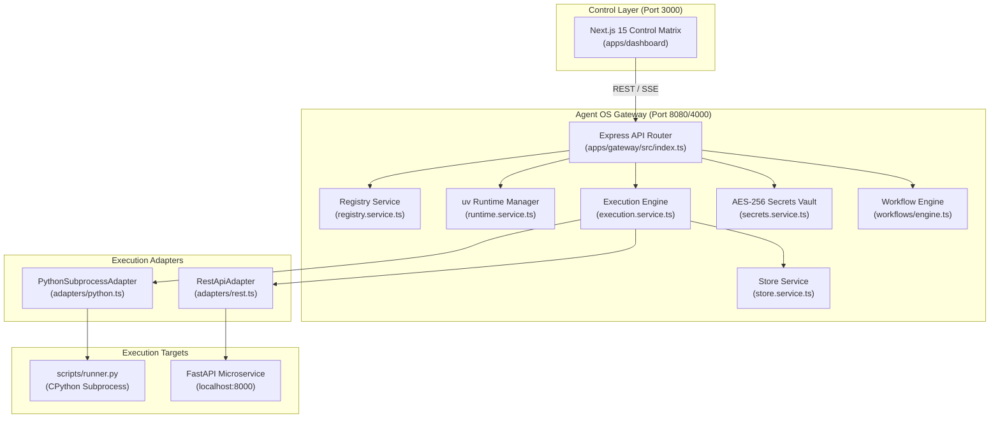
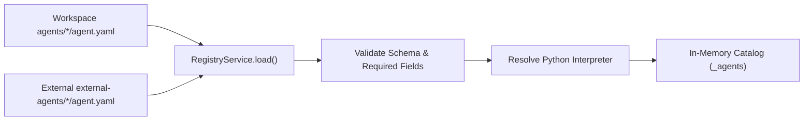
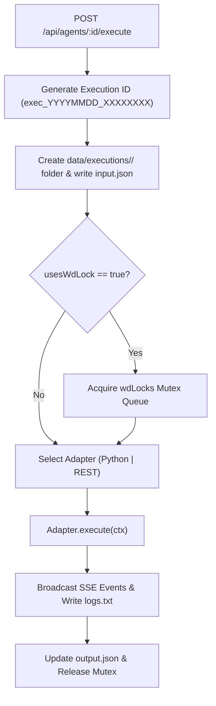
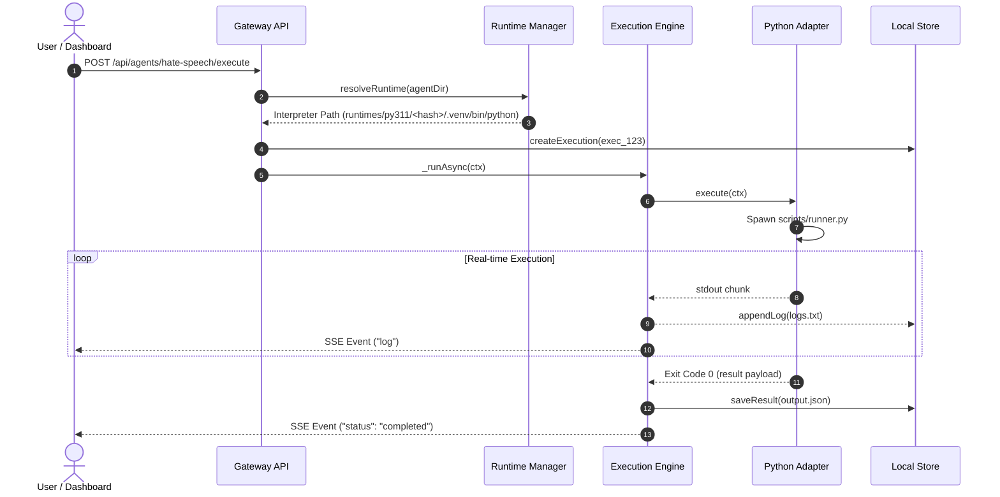

# Current Architecture — Agent Workspace (Agent OS)

This document describes **ONLY the architecture that exists in the codebase today**.

---

## 1. System Overview

Agent Workspace is a local-first, monorepo AI agent orchestration platform designed to discover, run, stream, manage, and chain heterogeneous AI agents (CrewAI, LangChain, RAG, Python scripts, and REST microservices).

---

## 2. High-Level Architecture



---

## 3. Component Responsibilities

| Component | Path | Responsibility |
| --- | --- | --- |
| **API Gateway** | `apps/gateway/src/index.ts` | Express HTTP router handling `/api/agents`, `/api/executions`, `/api/workflows`, `/api/secrets`, `/api/runtimes`, `/api/health`. |
| **Registry Service** | `apps/gateway/src/services/registry.service.ts` | Scans `agents/*/agent.yaml` and `external-agents/*/agent.yaml`. Resolves interpreters, maintains in-memory catalog, supports hot-reloading and dynamic imports. |
| **Runtime Manager** | `apps/gateway/src/services/runtime.service.ts` | Computes SHA-256 dependency hashes, builds isolated `uv` virtualenvs in `runtimes/py311/<hash>/.venv`, handles atomic `.lock` files, enforces GC rules. |
| **Execution Engine** | `apps/gateway/src/services/execution.service.ts` | Orchestrates runs, acquires working-directory locks (`usesWdLock`), manages active SSE streams (`eventLog`), handles cancellations (`tree-kill`). |
| **Store Service** | `apps/gateway/src/services/store.service.ts` | Manages per-execution folders `data/executions/<id>/` (`input.json`, `output.json`, `logs.txt`, `artifacts/`), updates `index.json`, prunes old runs. |
| **Secrets Vault** | `apps/gateway/src/services/secrets.service.ts` | Encrypts credentials using AES-256-GCM in `data/secrets/vault.json`. Injects keys into RAM at process spawn time. |
| **Workflow Engine** | `apps/gateway/src/workflows/engine.ts` | Loads `workflows/*.yaml`, validates DAG step dependencies, resolves template expressions, streams step logs, aggregates artifacts. |
| **Dashboard UI** | `apps/dashboard/src/` | Next.js 15 App Router interface featuring Agent Registry, Workflow Catalog, Execution Console with live SSE terminal, and Secrets Vault. |

---

## 4. Agent Discovery

Agents are defined by `agent.yaml` manifests located under `agents/<id>/` or `external-agents/<id>/`.



---

## 5. Registry

The registry maintains an in-memory array `_agents` of `AgentDefinition` objects.
- **Listing**: `GET /api/agents` returns all discovered agents.
- **Lookup**: `GET /api/agents/:id` returns a single agent definition.
- **Reloading**: `POST /api/agents/reload` rescans disk manifests without restarting the Node server.
- **Importing**: `POST /api/registry/import` copies external agent folders into `external-agents/<id>/` and registers them.

---

## 6. Environment Resolution (Local-First Discovery and Reuse)

Agent OS utilizes a local-first environment resolution model. Before creating a managed runtime, it scans the workstation for compatible existing Python environments (project-local venvs, parent virtualenvs, conda paths, system pythons) and checks if their installed packages satisfy the agent's requirements.

If a compatible environment is discovered, it is reused directly. Otherwise, the engine falls back to the Runtime Manager to create/use a managed `uv` virtualenv.

### Managed Runtime Manager (Fallback)

When a managed runtime must be created:
$$\text{Runtime Hash} = \text{SHA256}\Big(\text{PythonVersion} \mathbin{\Vert} \text{SourceType} \mathbin{\Vert} \text{NormalizedContent}\Big)\Big|_{0..16}$$

```
runtimes/py311/<hash>/
├── .venv/
│   ├── bin/python (or Scripts/python.exe)
│   └── lib/python3.11/site-packages/
├── metadata.json
└── source.lock
```

- **Build Lock**: Atomic lockfile `runtimes/py311/<hash>.lock` prevents concurrent compilation.
- **Garbage Collection**: Deletes runtimes where `agentCount == 0` or unused > 30 days when total storage exceeds 10 GB quota, protecting top 3 MRU runtimes.

---

## 7. Execution Engine

Handles async execution dispatches and SSE events.



---

## 8. Adapter Layer

The engine interacts with execution targets exclusively through the `AgentAdapter` interface.

```typescript
export interface AgentAdapter {
  execute(ctx: AdapterContext): AdapterHandle;
  health(agent: AgentDefinition): Promise<HealthResult>;
  cancel?(executionId: string): Promise<void>;
}
```

- **`PythonSubprocessAdapter`**: Spawns `scripts/runner.py` using the resolved CPython interpreter. Parses stdout JSON lines (`{type, data}`).
- **`RestApiAdapter`**: Polls HTTP microservices (e.g., `POST /generate-meeting-notes` then `GET /jobs/<job_id>`).

---

## 9. Execution Isolation

Every execution is strictly isolated in its own filesystem directory:

```
data/executions/exec_20260812_a1b2c3d4/
├── input.json      ← Injected input parameters
├── output.json     ← Final ExecutionRecord state & structured output
├── logs.txt        ← Appended stdout, stderr, and gateway logs (5MB cap)
└── artifacts/      ← Moved agent output files
```

---

## 10. Streaming

Real-time streaming uses Server-Sent Events (SSE) via `GET /api/executions/:id/stream`.

**SSE Event Types**:
- `status`: `queued`, `started`, `running`, `completed`, `failed`, `cancelled`.
- `log`: Raw stdout/stderr lines formatted as `{type: "log", data: "..."}`.
- `result`: Structured JSON output payload.
- `error`: Exception or execution error message.
- `warning`: Non-fatal operational warning.

Late-connecting clients receive a full log replay from the `ActiveExecution.eventLog` buffer upon connection.

---

## 11. Persistence

State is persisted strictly to the local filesystem without external database dependencies.
- **Execution Folder**: `data/executions/<id>/`.
- **Global Index**: `data/executions/index.json` maintaining lightweight execution summary metadata.
- **Pruning**: Retention policy caps execution history at 50 runs or 14-day TTL.

---

## 12. Logging

Logs are written concurrently to SSE clients and disk (`logs.txt`).
- Standardized log timestamp format: `YYYY-MM-DDTHH:MM:SS.sssZ [source] message`.
- 5 MB size limit per log file with truncation of oldest lines if limit is exceeded.

---

## 13. Health

Health checks run real-time diagnostics on demand (`GET /api/agents/:id/health`).
- **Python Subprocess Agents**: Checks interpreter path existence, working directory validity, required environment variables, and executes `python -c "import sys; print(sys.version)"` with a 5s timeout.
- **REST Agents**: Performs HTTP GET request to health endpoint expecting HTTP 200 with `{ "status": "healthy" }`.

---

## 14. Workflows

Multi-agent pipelines are declared in `workflows/*.yaml` and orchestrated by `workflows/engine.ts`.
- **Parsing**: `workflows/parser.ts` parses YAML manifests.
- **Validation**: Ensures no duplicate step IDs, valid agent references, and prohibits forward references in step DAGs.
- **Interpolation**: `workflows/resolver.ts` interpolates template expressions (`${input.prompt}`, `${steps.stepId.output.property}`).
- **Step Log & Artifact Aggregation**: Streams step logs (`step_started`, `step_log`, `step_completed`) and copies step output artifacts into `data/executions/<runId>/artifacts/<stepId>/`.

---

## 15. Gateway API

Key REST API routes exposed on `http://localhost:8080` (or `4000`):
- `GET /api/agents`: List all discovered agents.
- `GET /api/agents/:id`: Get single agent definition.
- `GET /api/agents/:id/health`: Check agent health.
- `POST /api/agents/reload`: Rescan agent manifests.
- `POST /api/agents/:id/execute`: Trigger agent execution.
- `GET /api/executions/:id/stream`: Stream SSE execution logs.
- `GET /api/executions`: List execution history.
- `GET /api/executions/:id`: Get full execution record.
- `POST /api/executions/:id/cancel`: Cancel active execution.
- `GET /api/workflows`: List workflow templates.
- `POST /api/workflows/:id/execute`: Run multi-agent workflow.
- `GET /api/runtimes`: List managed `uv` Python runtimes.
- `POST /api/runtimes/gc`: Trigger runtime garbage collection.
- `GET /api/secrets`: List stored secret key names.
- `POST /api/secrets`: Update secret key value in vault.

---

## 16. Dashboard

The frontend interface (`apps/dashboard`) is a Next.js 15 App Router React application.
- Uses `@tanstack/react-query` for data fetching and state caching.
- Features real-time log viewers, agent matrix cards, workflow graph runners, and secret vault controls.
- Loosely coupled via standard REST and SSE APIs (`NEXT_PUBLIC_GATEWAY_URL`).

---

## 17. Security

- **Local-First Boundary**: Binds to `localhost` by default. Zero external cloud tracking or telemetry.
- **Secrets Vault**: AES-256-GCM encrypted local storage (`data/secrets/vault.json`). Credentials decrypted strictly into in-memory process environment blocks at spawn time.
- **Log Masking**: Secret values are automatically redacted from SSE streams and log files.

---

## 18. Deployment

Supports bare-metal local development and containerized Docker composition.
- **Local Dev**: Node.js 20+, Python 3.10+, `uv`. Started via `npm run dev`.
- **Docker Compose**: `docker-compose.yml` orchestrates `gateway` (port 8080) and `dashboard` (port 3000) containers with persistent volume mounts (`/app/data`, `/app/runtimes`, `/root/.cache/uv`).

---

## 19. Data Flow



---

## 20. Current Limitations

1. **Local Disk Requirement**: Runtimes and execution folders rely on local POSIX/Windows filesystems.
2. **Subprocess Isolation Bounds**: Subprocesses run with the OS permissions of the Gateway node (package isolation, not strict container kernel sandboxing).
3. **Requirements Text Hashing**: Hashing unpinned `requirements.txt` relies on string descriptor text rather than lockfile digests unless `uv.lock` is committed.
