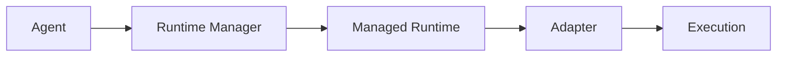
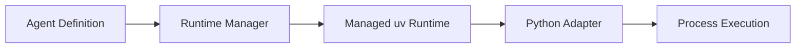

# Agent Workspace — Architecture

## Overview

```
┌────────────────────────────────────────────────────────────┐
│                    Agent Workspace                         │
│                                                            │
│  apps/gateway (Express + TypeScript, Port 8080)            │
│  ┌──────────────┐  ┌─────────────────────────────────────┐ │
│  │  REST Routes │  │         Core Services               │ │
│  │              │  │                                     │ │
│  │ GET  /agents │─▶│  RegistryService                    │ │
│  │ POST /execute│─▶│    └─ scans agents/*/agent.yaml     │ │
│  │ GET  /stream │─▶│    └─ auto-resolves interpreter     │ │
│  │ GET  /logs   │  │                                     │ │
│  │ POST /cancel │  │  HealthService                      │ │
│  └──────────────┘  │    └─ subprocess check              │ │
│                    │    └─ HTTP endpoint check            │ │
│                    │    └─ env var validation             │ │
│                    │                                     │ │
│                    │  ExecutionService                    │ │
│                    │    └─ per-WD mutex                   │ │
│                    │    └─ SSE broadcast                  │ │
│                    │    └─ adapter selection              │ │
│                    │    └─ tree-kill cancellation         │ │
│                    │                                     │ │
│                    │  StoreService                       │ │
│                    │    └─ data/executions/<id>/         │ │
│                    │       ├─ input.json                 │ │
│                    │       ├─ output.json                │ │
│                    │       ├─ logs.txt                   │ │
│                    │       └─ artifacts/                 │ │
│                    └─────────────────────────────────────┘ │
│                                    │                        │
│                         ┌──────────┴─────────┐             │
│                         │    Adapters         │             │
│                         │                    │             │
│                    ┌────┴───┐          ┌─────┴──────┐      │
│                    │ Python │          │ REST       │      │
│                    │Adapter │          │Adapter     │      │
│                    └────┬───┘          └─────┬──────┘      │
│                         │                    │             │
└─────────────────────────┼────────────────────┼─────────────┘
                          │                    │
         ┌────────────────▼──┐    ┌────────────▼───────────┐
         │  scripts/runner.py│    │  FastAPI Service        │
         │                  │    │  (localhost:8000)        │
         │  Dispatches to:  │    │                         │
         │  - hate-speech   │    │  meeting-notes-api      │
         │  - devops-log    │    │  (CrewAI + Postgres)    │
         │  - stock-analyst │    └─────────────────────────┘
         │  - podcaster-crew│
         │  - myntra-rag    │
         └──────────────────┘
                  │
     ┌────────────┼───────────────┐
     │            │               │
     ▼            ▼               ▼
D:/Javed/outskill/...   D:/Javed/outskill/...   D:/Javed/outskill/...
(beginner/)      (intermediate/v2)   (podcaster_crew/)
```

---

## Component Details

### RegistryService (`registry.service.ts`)

**Responsibility:** Discover and load all agents from `agents/*/agent.yaml`.

**Algorithm:**
1. Scan `agents/` directory for subdirectories
2. For each subdirectory, check for `agent.yaml`
3. Parse YAML → validate required fields (`id`, `name`, `workingDirectory`, `entrypoint`)
4. Auto-resolve Python interpreter from `workingDirectory`:
   - Check managed `uv` runtimes (`runtimes/py311/<hash>/.venv`)
   - Check local `.venv311/Scripts/python.exe`
   - Check local `.venv/Scripts/python.exe`
   - Check local `venv/Scripts/python.exe`
   - Fallback to `"python"` (system)
5. Build `AgentDefinition` in-memory
6. Expose `listAgents()`, `getAgent(id)`, `reload()`

**Adding a new agent:** Create `agents/<id>/agent.yaml`. Call `POST /api/agents/reload` or restart the gateway.

---

### Managed Runtime System (`runtime.service.ts`)

Interpreter resolution in Agent Workspace now prefers **managed runtimes** over walking local `.venv` directories. When an agent is loaded or imported, the Runtime Manager detects its dependency descriptor (`uv.lock`, `pyproject.toml`, or `requirements.txt`) and computes a SHA-256 fingerprint. If a matching isolated environment exists under `/app/runtimes/py311/<hash>/.venv`, the agent uses the managed interpreter automatically.

#### Execution Architecture Flow



**Key Capabilities:**
- **Lockfile Fingerprinting**: Hash calculated from Python version + normalized lockfile contents (`SHA-256` truncated to 16 chars).
- **Package Deduplication**: Agents with identical resolved dependencies share the same virtual environment; `uv`'s global package cache deduplicates packages on disk across different runtimes.
- **Stale Detection**: Diagnostics detect when an agent's source dependency file changes relative to its installed runtime, flagging a warning in health checks without breaking active executions.
- **Automated GC**: Purges orphaned runtimes (`agentCount == 0`), stale runtimes (> 30 days unused), and maintains storage below a 10 GB quota while protecting the 3 most recently used runtimes.

---

### HealthService (`health.service.ts`)

**Subprocess agents:**
1. Check interpreter path exists on disk
2. Check working directory exists
3. Scan for missing required env vars (local `.env` tree + gateway `process.env`)
4. Run `python -c "import sys; print(sys.version)"` with 5s timeout

**REST agents:**
1. HTTP GET to `healthCheck.endpoint`
2. Expect HTTP 200 with `{ "status": "healthy" }` body

**Env fallback model:**
```
Local agent .env (highest priority)
  ↓ fills gaps
Gateway .env / process.env (fallback for missing keys)
```

---

### ExecutionService (`execution.service.ts`)

**Flow:**
```
POST /execute
  │
  ├─ generateExecId()         → exec_YYYYMMDD_XXXXXXXX
  ├─ storeService.createExecution()  → creates data/executions/<id>/ with input.json
  ├─ activeExecutions.set()   → registers SSE consumer map
  │
  ├─ [if usesWdLock] acquireWdLock(workingDir)  → serialize concurrent runs
  │
  ├─ select adapter (python | rest)
  ├─ adapter.execute(ctx)     → returns AdapterHandle with cancel()
  │
  └─ SSE events flow through FakeResponse → broadcast() → consumer responses
       ├─ "status": "started"
       ├─ "log": ...           (real-time)
       ├─ "result": {...}      → persisted to output.json
       └─ "status": "completed" / "failed" / "cancelled"
```

**Cancellation:** `POST /executions/:id/cancel` → `treeKill(pid, "SIGKILL")` on Windows.

---

### StoreService (`store.service.ts`)

**Execution isolation (Step 5):**

Each execution gets a private folder:
```
data/executions/exec_20260812_a1b2c3d4/
├── input.json      ← written by Node before runner starts
├── output.json     ← full ExecutionRecord, updated on each status change
├── logs.txt        ← all [stdout], [stderr], [gateway] lines (5MB cap)
└── artifacts/      ← agent output files moved here by runner.py
```

**Index:** `data/executions/index.json` — lightweight `[{id, agentId, status, startTime, endTime, durationMs}]`.

**Retention:** 50 executions max, 14-day TTL. Pruned at execution completion.

---

### Adapters

#### PythonSubprocessAdapter (`adapters/python.ts`)

Spawns `scripts/runner.py` using the agent's venv interpreter:
```
<interpreter> scripts/runner.py --mode <agentId> --inputs <json> --run-dir <runDir>
```

- stdout: JSON-line events (`{type, data}`)
- stderr: forwarded as `{type: "log"}` events
- Cancellation: `treeKill(pid, "SIGKILL")`

#### RestApiAdapter (`adapters/rest.ts`)

Polls a FastAPI service:
1. `POST /generate-meeting-notes` → get `job_id`
2. `GET /meeting-notes/jobs/<job_id>` every 2s
3. Emit SSE events until `COMPLETED` or error
- Cancellation: sets a flag; next poll exits cleanly

---

## Data Flow: New Agent Registration

```
Developer creates agents/<id>/agent.yaml
           │
           ▼
POST /api/agents/reload
           │
           ▼
RegistryService.reload()
  → scans agents/ directory
  → parses agent.yaml
  → auto-resolves interpreter
  → adds to in-memory registry
           │
           ▼
GET /api/agents → new agent appears
GET /api/agents/<id>/health → health check works
POST /api/agents/<id>/execute → execution works
```

**Zero code changes required to add a new agent.**

---

### Managed Runtime System

Interpreter resolution prefers managed `uv` runtimes before local `.venv` walkup discovery.

When an agent is imported or executed:
1. The **Runtime Manager** inspects the agent's working directory for dependency descriptors (`uv.lock`, `pyproject.toml`, `requirements.txt`).
2. Calculates the normalized SHA-256 fingerprint of the dependency graph and Python version.
3. Attaches the agent to a managed, content-addressed virtual environment in `~/.agent-os/runtimes` (or `/app/runtimes` in Docker).
4. Auto-resolves the Python interpreter path (`.venv/bin/python` or `.venv/Scripts/python.exe`) for execution.


