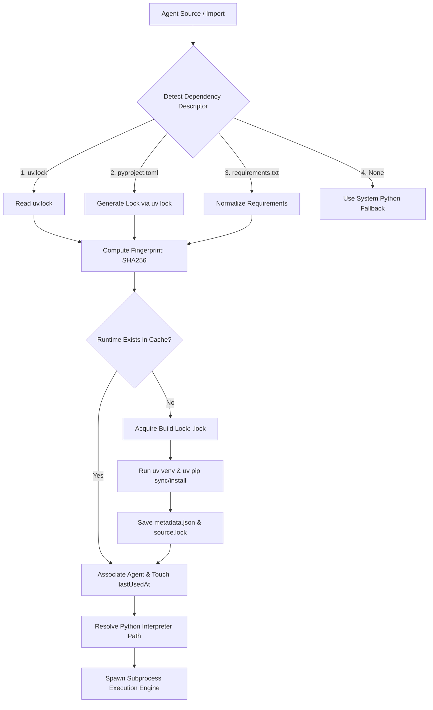

# Runtime Architecture — Agent Workspace

## 1. Executive Summary

Agent Workspace is a local-first AI agent operating system designed to import, configure, and execute arbitrary Python agents from directories, Git repositories, or ZIP archives. In a multi-agent environment, agents depend on diverse and often conflicting Python package stacks (e.g., CrewAI, LangChain, FAISS, PyTorch, Google Generative AI).

The **Agent Workspace Runtime Manager** provides isolated, deterministic, and disk-efficient Python execution environments powered by Astral's **`uv`** package manager. Rather than maintaining heavy duplicated `.venv` directories for every imported agent or relying on a fragile global Python environment, the system utilizes a **content-addressed, reusable runtime architecture**. Runtimes are defined by the SHA-256 fingerprint of their resolved dependency graph and Python version. Agents with identical dependencies automatically share the same sandboxed virtual environment, while `uv`'s global package cache ensures physical disk deduplication across different runtimes.

---

## 2. Why This Architecture?

### The Problem with Traditional Virtual Environments

Standard Python agent deployment models suffer from significant structural flaws when scaling to dozens or hundreds of imported agents:

1. **Duplicated Packages & Heavy Disk Usage**: Creating a standalone `.venv` for every agent results in massive redundancy. A single CrewAI installation can consume 1.5 GB to 2.5 GB of disk space. Multiplying this across 20 imported agents leads to 30 GB–50 GB of disk consumption for essentially identical libraries.
2. **Slow Import & Setup Times**: Running standard `pip install` or `python -m venv` sequentially during agent import introduces 2 to 5 minute delays per agent, degrading the user experience.
3. **Inconsistent Environments**: Environment drifts occur when dependencies are installed at different times without strict lockfile normalization.
4. **Difficult Lifecycle Management**: Tracking when virtual environments become orphaned, stale, or broken requires manual cleanup by the developer.

### The Content-Addressed Shared Runtime Model

To solve these challenges, Agent Workspace decouples the **agent definition** from the **execution runtime**. 

```
┌─────────────────────────────────────────────────────────┐
│                    Imported Agents                      │
│   [Agent A: CrewAI]   [Agent B: CrewAI]   [Agent C: RAG]│
└───────────┬───────────────────┬──────────────────┬──────┘
            │                   │                  │
            └─────────┬─────────┘                  │
                      ▼                            ▼
        ┌───────────────────────────┐  ┌───────────────────────┐
        │ Shared Runtime (py311/A1) │  │ Shared Runtime (py311/B2) │
        │ /app/runtimes/py311/a1... │  │ /app/runtimes/py311/b2... │
        └─────────────┬─────────────┘  └───────────┬───────────┘
                      │                            │
                      └─────────────┬──────────────┘
                                    ▼
                     ┌──────────────────────────────┐
                     │   Global Package Cache (uv)  │
                     │    /root/.cache/uv/wheels    │
                     └──────────────────────────────┘
```

When an agent is imported or executed, the system analyzes its dependency descriptor (`uv.lock`, `pyproject.toml`, or `requirements.txt`), normalizes the manifest, and computes a 16-character SHA-256 hash. If an isolated runtime with an identical fingerprint already exists, the agent instantly attaches to it. If not, a new isolated runtime is created using `uv` in seconds.

---

## 3. Design Goals

* **Local-First**: Operates completely offline without requiring cloud runtime coordination or external container registries.
* **Deterministic**: Identical dependency descriptors yield identical runtime fingerprints and package resolution.
* **Reproducible**: Lockfile-first resolution guarantees exact package version enforcement.
* **Efficient Disk Usage**: Two-layer deduplication (runtime reuse + `uv` hardlinked package cache) reduces disk footprint by up to 90%.
* **Fast Startup**: Instant execution for agents matching existing runtimes; sub-second environment creation via `uv`.
* **Safe Concurrent Builds**: File-based build locks prevent duplicate compilation jobs when multiple agents trigger runtimes simultaneously.
* **Observable and Maintainable**: Integrated diagnostic status (available, warning, unavailable, stale) surfaced through health endpoints and UI dashboards.

---

## 4. High-Level Architecture

The flow from agent import to subprocess execution proceeds through dependency detection, lockfile normalization, fingerprint computation, cache lookup/build, and interpreter invocation.



---

## 5. Dependency Detection Strategy

When an agent directory is scanned, the Runtime Manager inspects the workspace root of the agent for dependency descriptors using a strict priority hierarchy:

1. **`uv.lock` (Highest Priority)**:
   - Indicates a fully resolved, pinned dependency graph.
   - Read directly without modification. Used with `uv sync --frozen`.
2. **`pyproject.toml` (Second Priority)**:
   - Modern PEP 517/518/621 project descriptor.
   - Converted to a deterministic lock via `uv lock` or installed via `uv pip install`.
3. **`requirements.txt` (Third Priority)**:
   - Standard requirements list.
   - Normalized by stripping comments, trimming inline whitespace, and sorting entries alphabetically before hashing.

If no dependency descriptor is present, the agent is assigned a system Python fallback (`python3` / `python`), bypassing managed runtime directory creation.

---

## 6. Hashing and Identity

Runtime identity is governed by a content-addressed SHA-256 fingerprint truncated to 16 hexadecimal characters for clean directory naming:

$$\text{Runtime Directory} = \text{/app/runtimes/py311/}\langle \text{Hash} \rangle\text{/}$$

### Normalization Rules

To ensure that minor formatting differences (e.g., blank lines, comments, line ordering) do not create duplicate runtimes, the input content is normalized prior to hashing:

1. All comments starting with `#` and inline comments are stripped.
2. Every line is trimmed of leading and trailing whitespace.
3. Blank lines are removed.
4. Remaining dependency specification lines are sorted lexicographically.
5. The target Python major/minor version (e.g., `3.11`) is prepended to the input stream.

### Formula

$$\text{Fingerprint} = \text{SHA256}\Big(\text{PythonVersion} \mathbin{\Vert} \text{"\n"} \mathbin{\Vert} \text{NormalizedDescriptorContent}\Big)\Big|_{0..16}$$

Including the Python version in the hash guarantees that upgrading the system or target Python interpreter isolates packages built for different CPython ABIs.

---

## 7. Runtime Build Process

### Build Lock Strategy

To prevent race conditions when multiple agents with identical dependencies are imported concurrently, the Runtime Manager enforces file-based build locking:

* Lock File Location: `/app/runtimes/py311/<hash>.lock`
* Lock Metadata: Includes process ID (`pid`) and creation timestamp (`createdAt`).
* Timeout: Waiting processes poll the lock file every 1,000 ms up to a 5-minute limit (`BUILD_TIMEOUT_MS`).
* Stale Lock Recovery: If a lock file's modification time exceeds 5 minutes (indicating a crashed worker process), the lock is automatically cleaned up and acquired by the waiting process.

### Runtime Folder Layout

```
/app/runtimes/
└── py311/
    └── a1b2c3d4e5f6a7b8/
        ├── .venv/
        │   ├── bin/python (or Scripts/python.exe on Windows)
        │   ├── lib/python3.11/site-packages/
        │   └── pyvenv.cfg
        ├── metadata.json
        └── source.lock
```

### Build Execution Steps

1. Create directory structure: `/app/runtimes/py311/<hash>/`.
2. Write initial `metadata.json` with state `"building"`.
3. Create isolated virtual environment:
   ```bash
   uv venv /app/runtimes/py311/<hash>/.venv --python 3.11
   ```
4. Install/Synchronize packages using `uv` (with `VIRTUAL_ENV` set to `.venv`):
   ```bash
   # For lockfiles:
   uv sync --frozen
   # For requirements.txt:
   uv pip install -r requirements.txt
   ```
5. Update `metadata.json` state to `"available"`, recalculate directory `sizeBytes`, and update timestamp.
6. Release `.lock` file in a `finally` block.

---

## 8. Runtime Reuse

Runtimes are decoupled from individual agent identifiers. Multiple imported agents that share identical dependency descriptors automatically share the exact same runtime environment.

### Association Tracking

Each runtime's `metadata.json` tracks associated agents:

```json
{
  "hash": "a1b2c3d4e5f6a7b8",
  "python": "3.11",
  "pythonShort": "py311",
  "agents": ["hate-speech-v1", "hate-speech-v2", "moderation-crew"],
  "agentCount": 3,
  "sizeBytes": 1932735283,
  "createdAt": "2026-08-14T01:00:00Z",
  "lastUsedAt": "2026-08-14T01:45:00Z",
  "sourceHash": "e3b0c44298fc1c149afbf4c8996fb92427ae41e4649b934ca495991b7852b855",
  "sourceType": "requirements.txt",
  "state": "available"
}
```

When Agent B is imported and resolves to hash `a1b2c3d4e5f6a7b8`, `runtimeService.associateAgent()` appends `Agent B` to `agents` and increments `agentCount`. No new files are written to disk, resulting in zero additional disk overhead and sub-millisecond setup time.

---

## 9. Disk Efficiency

Agent Workspace achieves maximum disk efficiency via a two-layer deduplication model:

1. **Layer 1 — Runtime-Level Sharing**: Identical resolved environments share a single virtual environment on disk.
2. **Layer 2 — Package-Level Global Cache (`uv`)**: For runtimes that differ slightly (e.g., Runtime 1 has `crewai==0.28.0` and Runtime 2 has `crewai==0.28.0` plus `matplotlib`), `uv` stores wheel downloads and extracted package files in a global content-addressed cache (`/root/.cache/uv`). Virtual environment files are linked using hard links or reflinks where supported by the filesystem.

### Example Disk Usage Comparison

| Scenario | Standard `.venv` Per Agent | Agent Workspace Runtime Manager |
|---|---|---|
| 5 CrewAI Agents (Identical Dependencies) | $5 \times 1.8\text{ GB} = \mathbf{9.0\text{ GB}}$ | $1 \times 1.8\text{ GB} = \mathbf{1.8\text{ GB}}$ |
| 5 CrewAI Agents + 3 RAG Agents | $8 \times 1.8\text{ GB} = \mathbf{14.4\text{ GB}}$ | $1.8\text{ GB} (\text{CrewAI}) + 1.2\text{ GB} (\text{RAG}) = \mathbf{3.0\text{ GB}}$ |
| **Total Disk Savings** | Baseline | **~80% to 90% Savings** |

---

## 10. Stale Detection

When a developer edits an imported agent's `requirements.txt` or `pyproject.toml` file, the runtime environment must reflect these changes without corrupting ongoing executions.

### Mechanism

During health checks (`GET /api/agents/:id/health`) or prior to process execution:

1. The Runtime Manager re-reads the agent's current dependency descriptor and re-computes `currentSourceHash`.
2. The current hash is compared against `metadata.sourceHash`.
3. If `currentSourceHash !== metadata.sourceHash`:
   - The runtime is marked as `isStale = true` in health diagnostics.
   - The UI surfaces a warning badge: `⚠ Dependency file changed! Runtime is stale. Rebuild recommended.`
   - Existing executions are allowed to complete using the current environment to prevent runtime crashes.
   - The user or operator can trigger `POST /api/agents/:id/runtime/rebuild` to construct a new isolated runtime matching the updated descriptor.

---

## 11. Garbage Collection

To prevent unused virtual environments from accumulating over time, the Runtime Manager includes an automated Garbage Collector (`POST /api/runtimes/gc`).

### Collection Rules (Executed in Precedence Order)

1. **Orphan Removal**: Runtimes with `agentCount == 0` (all associated agents have been deleted) are marked for immediate deletion.
2. **Age-Based Expiration**: Runtimes unused for more than 30 days (`lastUsedAt < 30 days ago`) are purged.
3. **Storage Quota Enforcement**: If total storage across all managed runtimes exceeds the 10 GB limit (`maxQuotaBytes`), the oldest unused runtimes are deleted in Least Recently Used (LRU) order until total size falls below quota.
4. **Protected Runtimes**: The **3 most recently used runtimes** are explicitly protected from deletion regardless of age or storage quota.

---

## 12. Security Considerations

* **Local-Only Execution**: Runtimes execute locally within the host machine or gateway Docker container. No binary payloads or virtualenv state are uploaded to external cloud services.
* **Isolated Virtual Environments**: Each runtime uses `include-system-site-packages = false` in `pyvenv.cfg`, preventing pollution from host system libraries.
* **Secret Sanitization**: Environment variables and vault secrets (`secretsService`) are injected directly into child processes at spawn time. Secret values are **never stored** in `metadata.json`, `source.lock`, or runtime logs.
* **Concurrency Protection**: Atomic file locking prevents corrupt partial installations caused by concurrent build requests.
* **Sandbox Boundaries**: Managed Python runtimes provide package isolation, **not security sandboxing**. Subprocesses run with the system privileges of the gateway process. Additional OS-level isolation (e.g., Docker containers or seccomp profiles) should be used if running untrusted code.

---

## 13. Limitations

While the Runtime Manager delivers high performance and efficiency, developers should be aware of current architectural boundaries:

1. **Single-Node Storage**: Runtime directories are persisted to local disk (`/app/runtimes`). Distributed clustering across multiple gateway nodes requires shared POSIX storage (e.g., NFS, EFS) or container image pre-baking.
2. **Source-Based Hashing (Requirements Level)**: When using unpinned `requirements.txt` (e.g., `crewai`), hashing relies on the text descriptor rather than a fully resolved lockfile. Upstream package releases between initial build and rebuild may alter installed sub-dependencies without changing the source hash. Using `uv.lock` avoids this limitation.
3. **No Container Isolation**: Agents execute as child processes of the gateway node. Malicious agent code can access accessible host paths unless running inside Docker.
4. **Platform-Specific C-Binaries**: Pre-compiled Python wheels containing native C-extensions (e.g., `.so` on Linux, `.pyd` on Windows) are platform-dependent. Runtimes built on Windows cannot be transferred directly into Linux containers without rebuilding.
5. **Large ML Packages**: Heavy machine learning frameworks (PyTorch, TensorFlow, CUDA binaries) can exceed 2 GB per package. While `uv` caches these efficiently, initial downloads remain governed by network bandwidth.

---

## 14. Future Work

* **Resolved-Lock Fingerprinting**: Automatically generate `uv.lock` for all `requirements.txt` imports to enforce true lock-level cryptographic hashing.
* **Build Progress Streaming**: Expose SSE build streams during `uv pip install` so users can watch live package compilation progress in the dashboard UI.
* **Platform-Aware Cross-Platform Hashes**: Include platform architecture tags (`linux-x86_64`, `win-amd64`) in directory keys to allow dual-boot or hybrid deployments.
* **Signed Manifest Verification**: Integrate signature verification for imported agent packages before runtime build execution.
* **OCI Container Backend**: Support building per-runtime OCI micro-containers (Docker / Podman) alongside virtual environments for strict sandboxing.
* **Resource Quotas per Agent**: Enforce memory (cgroups) and CPU execution limits per runtime process tree.

---

## 15. Comparison with Other Approaches

| Metric / Feature | Per-Agent `.venv` | Conda Environments | Docker Container Per Agent | Agent Workspace Runtime Manager |
|---|---|---|---|---|
| **Setup Speed** | Slow (2–5 min) | Very Slow (3–8 min) | Slow (Image Build Required) | **Fast (< 1s reuse, 5s build via `uv`)** |
| **Disk Overhead** | High (Heavy duplication) | High (Heavy duplication) | Extremely High (Full OS layers) | **Low (Content-addressed + `uv` cache)** |
| **Package Resolver** | Standard `pip` | `conda` / `mamba` | Standard `pip` / OS pkgs | **`uv` (Astral Rust Resolver)** |
| **Multi-Agent Sharing**| None (Isolated) | None (Isolated) | None (Isolated) | **Automatic via Lockfile SHA-256** |
| **Local-First Native** | Yes | Yes | Requires Docker Daemon | **Yes (Works in Docker & Bare-Metal)** |
| **Stale Detection** | Manual | Manual | Manual | **Automatic (Hash-Based Diagnostics)** |
| **Garbage Collection** | None | Manual (`conda env remove`) | Manual (`docker image prune`) | **Automated (Age + Quota + LRU)** |

---

## 16. Operational Recommendations

1. **Prefer `uv.lock` over `requirements.txt`**: Commit `uv.lock` files to imported agent repositories to guarantee 100% deterministic dependencies across machines.
2. **Pin Gateway Python Version**: Standardize container and host environments on Python 3.11 for uniform wheel compatibility.
3. **Monitor Disk Quota**: Keep `runtimes` directory size monitored on host systems; schedule weekly `POST /api/runtimes/gc` maintenance calls in production deployments.
4. **Preserve `UV_CACHE_DIR`**: Ensure `./uv-cache:/root/.cache/uv` is mounted in `docker-compose.yml` to preserve pre-downloaded wheels across gateway container updates.

---

## 17. Conclusion

The **Agent Workspace Runtime Manager** addresses the core challenge of local-first multi-agent systems: running arbitrary, complex Python AI agents safely, deterministically, and efficiently without overwhelming system resources. 

By combining content-addressed runtime fingerprints, `uv`'s Rust-based resolution and global caching engine, file-level build locks, and automated lifecycle garbage collection, Agent Workspace provides a robust foundation for modern AI agent operations.
