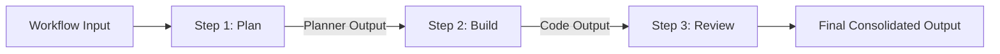

# Agent OS / Agent Workspace — Workflows Architecture & Specifications

## Overview

**Workflows** in Agent OS enable multi-agent orchestration by chaining individual agents into sequential or graph-based execution pipelines. Workflows are defined declaratively in `workflows/*.yaml` or configured via the Dashboard Workflow Catalog.

---

## Workflow Specification (`workflow.yaml`)

Each workflow manifest specifies metadata, participating agents, execution steps, and parameter mappings.

```yaml
id: generate-fastapi-app
name: FastAPI Application Generator
description: Plan, build, and review a FastAPI application sequentially using specialized agents.
version: 1.0.0

steps:
  - id: plan
    agentId: planner-agent
    inputMapping:
      prompt: "${input.prompt}"

  - id: build
    agentId: code-generator-agent
    inputMapping:
      plan: "${steps.plan.output.plan}"

  - id: review
    agentId: reviewer-agent
    inputMapping:
      code: "${steps.build.output.code}"
```

---

## Execution Model



### Key Workflow Features

1. **Step Chaining & Context Injection**: Output from step \(N\) is made available to step \(N+1\) via template interpolation (`${steps.stepId.output.property}`).
2. **Real-Time Step Streaming**: Each step emits dedicated Server-Sent Events (SSE) logs and status updates to the dashboard matrix.
3. **Fault Tolerance & Step Failure**: If any step in a workflow fails, subsequent dependent steps are halted and the workflow status marks the failure point.
4. **Execution History Storage**: Complete multi-agent workflow runs are stored in `data/executions/` with step-level input/output mapping records.

---

## Pre-Built Workflows

- **`generate-fastapi-app`**: Planner Agent $\rightarrow$ Code Generator Agent $\rightarrow$ Reviewer Agent.
- **`summarize-and-podcast`**: DevOps Log Analyzer $\rightarrow$ Podcaster Crew Agent.

---

## API Endpoints

- `GET /api/workflows`: List available workflow templates.
- `GET /api/workflows/:id`: Get detailed workflow graph and step schema.
- `POST /api/workflows/:id/execute`: Trigger execution of a workflow template.
